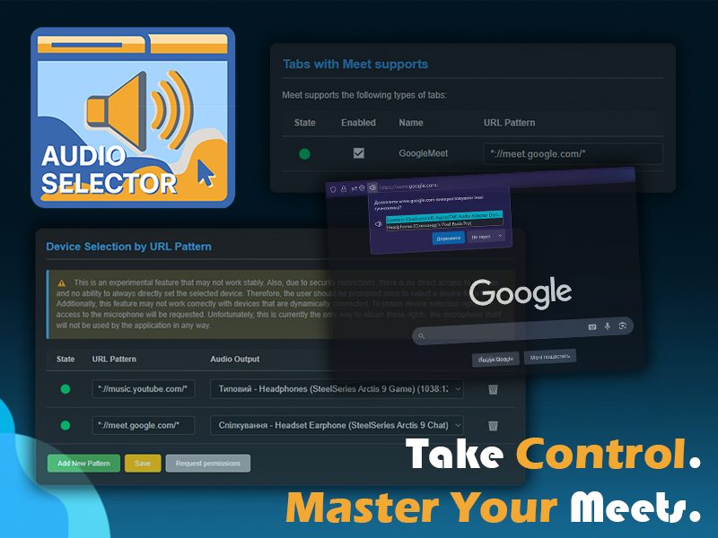

# Audio Selector

Audio Selector is a powerful browser extension that gives you granular control over your audio output devices and streamlines your online meetings. Easily route each browser tab's audio to any device you choose, and manage your video calls with a suite of intuitive keyboard shortcuts.

## 🌟 **Key Features**

* **Per-Tab Audio Routing**: Redirect audio from individual tabs to different output devices. For example, send music to your speakers while keeping video calls in your headphones, or route audio to a transcription tool like Krisp.
* **Meeting Shortcuts**: Boost your productivity with custom hotkeys to manage your meetings without switching tabs.
  * **Toggle Mic**: Mute or unmute your microphone in the active meeting tab from anywhere.
  * **Toggle Camera**: Turn your camera on or off in the active meeting tab without leaving your current work.
  * **Switch Tabs**: Quickly cycle through your active meeting tabs.
  * **Join Meeting**: Join a meeting with a single shortcut if it's the only one open.
* **Automatic Device Switching**: Configure URL patterns to automatically switch audio devices for specific websites. This is perfect for setting up a "music" profile for Spotify or a "meeting" profile for Google Meet.
* **Open Source**: The entire codebase is open source, allowing for community contributions and complete transparency.

## 🛠️ **How It Works**

Audio Selector is designed to give you fine-grained control over media output and meeting controls. The core functionality is built on several key mechanisms:

* **Meeting Integration**: The extension works with various meeting platforms by recognizing them via their URL patterns. For each supported platform (currently Google Meet), a dedicated content script (`gmeet.js`) is injected into the tab. This script contains methods to get the current meeting status, join a call, and toggle the microphone and camera state by interacting with the page's DOM.
* **Audio Device Selection**: The extension manages audio output by manipulating the `sinkId` property of HTML5 audio and video elements within a web page. This allows it to route the audio from a specific tab to any available device.
* **Permission Handling**: To gain the necessary permissions to manipulate the `sinkId` and select an audio output device, the extension must request access to the "Media Capture and Streams API". This requires a microphone permission request. **It is important to note that the extension requests microphone access only to obtain these rights and does not use or access your microphone's data in any way**.

## 🚀 **Planned Features**

* **Popup UI**: A new popup interface will display a list of all active meeting tabs and tabs with an overridden audio device.
* **Quick Actions**: The popup will allow you to quickly mute/unmute or change the audio device for any listed tab.
* **Expanded Meeting Support**: We plan to add support for other popular meeting platforms, including **Zoom** and **Microsoft Teams**.

## 💻 **Getting Started**

You can install the extension from the official stores or load it manually:

* [**Chrome Web Store**](https://chromewebstore.google.com/detail/audio-selector/nladhmjchmoeoadjnckmoemmapkjhalb)
* [**Firefox Add-ons**](https://addons.mozilla.org/uk/firefox/addon/audio-selector/)
* **Opera** (coming soon)

Alternatively, you can load the extension as an unpacked extension in your browser*.

* First, clone or download this repository.
* If a browser-specific manifest file exists (e.g., `manifest_opera.json`), you may need to make copy and rename it to `manifest.json` before loading.
* Install it as developer. Instructions for:
[Chrome](https://developer.chrome.com/docs/extensions/get-started/tutorial/hello-world#load-unpacked) |
[Firefox](https://extensionworkshop.com/documentation/develop/temporary-installation-in-firefox/) |
[Opera](https://help.opera.com/en/extensions/testing/)

**Note:** Extensions loaded this way will not receive automatic updates. You will need to pull changes and reload the extension manually.

## 📜 **Changelog**

### **v0.3.3** - 2025-08-13

* **Added**
  * Powershell script that creates archives for each browse.
* **Fixed**
  * Not working changing output device on active media.

### **v0.3.2** - 2025-08-13

* **Added**
  * Added support for the **Opera** browser.
  * A banner image has been added.
  * Google Meet support is now enabled by default upon installation.
  * The `Open in shortcuts settings` button for Chrome is now enabled.
  * The extension now watches for shortcut changes to automatically update and display them on the options page.
  * The options page opens automatically upon installation.
* **Changed**
  * "google meet" was replaced with "meet" in the shortcut descriptions.
* **Fixed**
  * The auto-selection of audio devices for tabs with auto-play has been fixed.
  * Several minor potential issues were addressed.
  * The width of input fields on the options page was corrected.
  * The updating of the state in the Meet supports table has been fixed.
  * The shortcut for joining Google Meet was fixed.

[View full changelog](Changelog.md)

## 🤝 **Contributing**

Your contributions are welcome! Feel free to report issues, suggest new features, or submit pull requests.

## 📄 **License**

This project is licensed under the MIT License. See the [LICENSE](https://github.com/OlexandrI/AudioSelector/blob/main/LICENSE) file for details.

_Icons by Krystyna Puzich — thank you for the design!_
